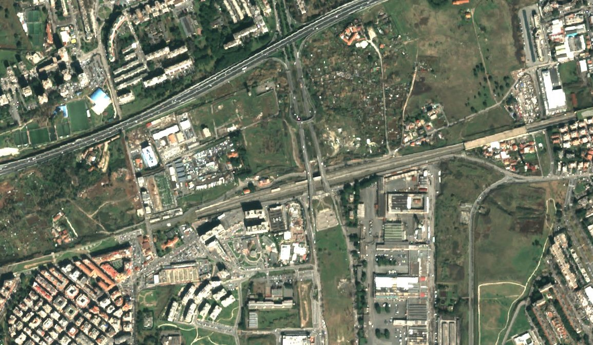

# True color product, Pleiades

## General description

The [true color](https://en.wikipedia.org/wiki/False_color#True_color) product maps Pleiades' band values B2, B1, and B0 which roughly correspond to red, green, and blue part of the spectrum, respectively, to R, G, and B components.

## Description of representative images

True color visualization of Rome.

