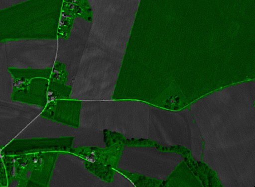

# Green City - Pansharpened Script, SPOT

## General description of the script

Uses [Normalized difference vegetation index (NDVI)](https://en.wikipedia.org/wiki/Normalized_difference_vegetation_index) to color SPOT images and create awareness of green areas in cities around the World. The script was modified to fit PlanetScope spectral bands. 
See also <a href="https://custom-scripts.sentinel-hub.com/sentinel-2/green_city/#">Green City for Pleiades.</a> 

## Description of representative images

Visualization of the port of Zgornje Konjišče, Slovenia with the Green City script. 
