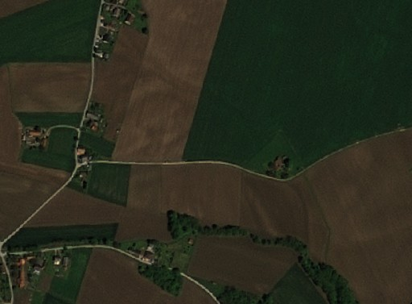

# True Color Pansharpened, SPOT

## General description

The [true color](https://en.wikipedia.org/wiki/False_color#True_color) product maps SPOT' band values B2, B1, and B0 which roughly correspond to red, green, and blue part of the spectrum, respectively, to R, G, and B components. The RGB bands with spectral resolution of 6 meters were pansharpened using the PAN band with spectral resolution of 1.5 meters. The result is a true colorimage with the resolution of 1.5 meters. 

## Description of representative images

True color visualization of Zgornje Konjišče, Slovenia.

