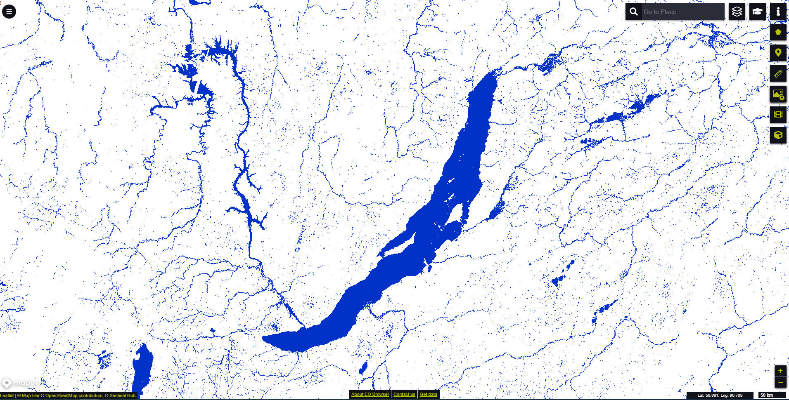

# Global Water Bodies visualisation script

## General description of the script  
This script visualizes surface water bodies extent derived from water Bodies detection layer (WB) contained in Water Bodies data.
 
Table 1: Color legend for the water bodies 
<table>
  <thead>
    <tr>
      <th>Value</th>
      <th>Color</th>
	    <th>Label</th>
    </tr>
  </thead>
  <tbody>
    <tr>
      <td>70 </td>
      <td style="background-color:#0032c8"></td>
	    <td> Water </td>
    </tr>
  </tbody>
</table>  

## Description of representative images
 *October 2020 monthly composite map showing surface water bodies extent around Russia's largest freshawater Baikal lake  visualised in EO browser*

