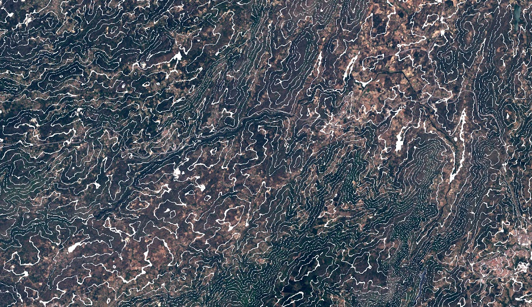

# DEM Contour Lines Over Landsat 8

## Evaluate and visualize  
 - [EO Browser](https://sentinelshare.page.link/D1ed)

## General description of the script  
  
This script uses DEM to calculate contour lines and displays them over Landsat-8 true color image. The contour lines can be modified in color, interval and width. The contour lines script can be found [here](https://custom-scripts.sentinel-hub.com/dem/contour-lines/).

## Description of representative images  
  
**Contour lines over L8**
