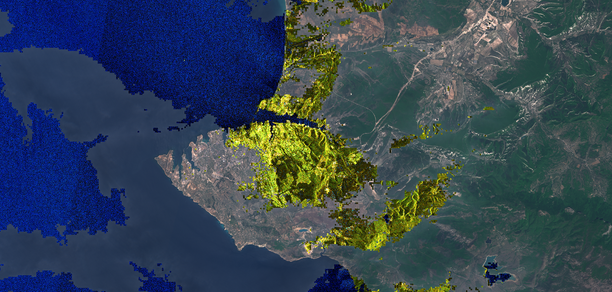

# Sentinel-2 with cloudy parts replaced by Sentinel-1

## Evaluate and visualize
 - [EO Browser](https://sentinelshare.page.link/KoE7)

## General description
The script uses cloud masks to identify cloudy sentinel-2 areas and replace the data with terrain visualisation based on Sentinel-1 data. 

## Description of representative images  

Sevastopol with cloudy areas in Sentinel-1, and non-cloudy areas in Sentinel-2. 

