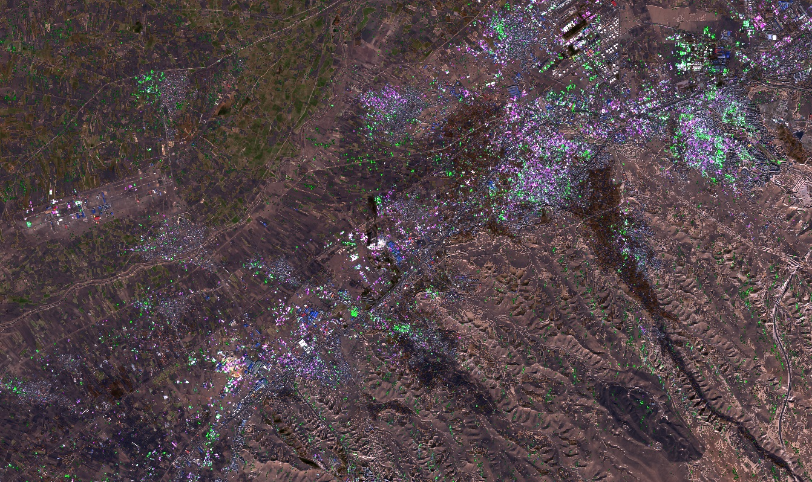
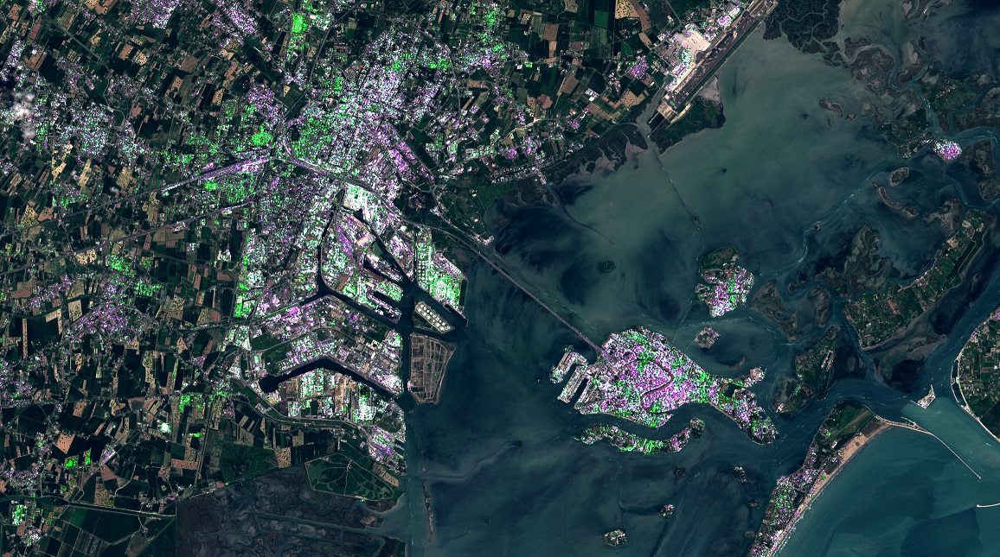

# Urban detection with Sentinel-1 and Sentinel-2

## Evaluate and visualize  
 - [EO Browser](https://sentinelshare.page.link/qBRg)
  
## General description of the script  
  
This script is based on the [Urban areas composite for Sentinel-1](https://custom-scripts.sentinel-hub.com/sentinel-1/urban_areas/). The script displayes highly reflective VV and VH pixels as built up, limiting them by using basic vegetation and water masking with Sentinel-2. It is prone to overestimation over high slope areas and barren rock. 

## Description of representative images  
  
**Tabriz, Iran**
 

**Venice, Italy**
  
